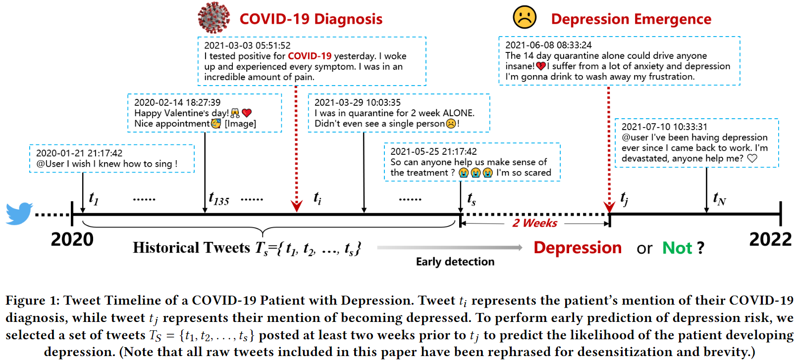

# DepCov-WWW2023

This repository includes the code and dataset details of the paper:

**Exploring Social Media for Early Detection of Depression in COVID-19 Patients**

**Authors:** Jia-Geng Wu, Xian Wu, Yi-Ning Hua, Shi-Xu Lin, Ye-Feng Zheng, Jie Yang

## Abstract

The COVID-19 pandemic has caused substantial damage to global health. Even though three years have passed, the world continues to struggle with the virus. Concerns are growing about the impact of COVID-19 on the mental health of infected individuals, who are more likely to experience depression, which can have long-lasting consequences for both the affected individuals and the world. Detection and intervention at an early stage can reduce the risk of depression in COVID-19 patients. 
In this paper, we investigated the relationship between COVID-19 infection and depression through social media analysis. Firstly, we managed a dataset of COVID-19 patients that contains information about their social media activity both before and after infection. Secondly, We conducted an extensive analysis of this dataset to investigate the characteristic of COVID-19 patients with a higher risk of depression. Thirdly, we proposed a deep neural network for early prediction of depression risk. This model considers daily mood swings as a psychiatric signal and incorporates textual and emotional characteristics via knowledge distillation. Experimental results demonstrate that our proposed framework outperforms baselines in detecting depression risk, with an AUROC of 0.9317 and an AUPRC of 0.8116. Our model has the potential to enable public health organizations to initiate prompt intervention with high-risk patients.



## Code

### Run

run.sh: the script to run the main.py

### Model

Analysis and paint: LIWC_analysis_before_after.ipynb, LIWC_depression_detection.ipynb, LDA.ipynb,

Baseline-Machine learning: tfidf.ipynb, LIWC_depression_detection.ipynb

Baseline-Deep Learning: in model.py, the details of model setting are recorded in main.py and model.py

Mood2Content: in model.py, the details of model setting are recorded in main.py and model.py

### Finetune

model_sentiment.py: for fine-tune the mood encoder from bert/covid-twitter-bert with the specific task

## Dataset

### Dataset Construction

We select original English tweets related to COVID-19 using unique tweet identifiers (tweet ID) from a widely used open-source COVID19 tweet database. These tweets were identified by Twitter’s trending topics and keywords associated with COVID-19, such as COVID-19 and SARS-COV-2. We first download 471,553,966 target tweets across 27 months, from February 1st, 2020, to April 30th, 2022, using Twitter API.
After the identification of COVID-19 patients, we further collect retrospective tweets between January 1st, 2020, and December 31st, 2021 from each infected user for further analysis and modeling.
Due to the mental disease problems brought by COVID-19, we presume that there are many vulnerable persons who may present depression risk after COVID-19 diagnosis. We split the entire user set into two groups according to their quantity and the corresponding timestamp of depression tweets: 1) the first group is the treatment group which includes users emitting depression signals after suffering COVID-19. We require users in this group to have posted more than three depression tweets and the first of which was posted at least two weeks after their COVID-19 diagnosis. In addition, these users never post a depression tweet before COVID-19. Particularly, we set a window period of two-week, a widely used time window in the diagnosis of mental disorders, between COVID-19 diagnosis and the emergence of depression risk and the subsequent modeling and analysis merely utilize their tweets before it; 2) the second group is the control group which includes users who don’t mention depression both before and after COVID-19 infection. For each user in the first group, we select 5 users with a similar quantity of tweets and add them to the second group. Besides, all eligible users must contain more than 25 tweets both before and after the COVID-19 diagnosis respectively, ≥ 75% of which are written in English.
In this manner, we build a dataset of COVID-19 patients with depression signals and name it the DepCOV dataset. DepCOV consists of 1,776 depression cases (positive) and 8,880 controls (negative), with 10,488,061 tweets. For model development and evaluation, We split the DepCOV into the training set, validation set, and testing set with the proportion of 7:1:2.

### **Data Access**

Firstly, because this dataset involved vulnerable groups (COVID-19 patients, depression users), we will not directly release dataset. And, this dataset will be shared upon reasonable request. All applicants must provide a detailed proposal and ethics approval, and sign a formal user agreement.

Secondly, following Twitter's automation rules and data security policy, we can not directly provide the original tweets to dataset consumer. Therefore, we will provide the structured data file with Tweet IDs. Based on the Tweet IDs provided by us, the dataset consumers could download the original tweets freely via official Twitter API by themselves.

## Cite

If you refer to our code or dataset in your research, please cite our paper:

```
@inproceedings{10.1145/3543507.3583867,
	author = {Wu, Jiageng and Wu, Xian and Hua, Yining and Lin, Shixu and Zheng, Yefeng and Yang, Jie},
	title = {Exploring Social Media for Early Detection of Depression in COVID-19 Patients},
	year = {2023},
	isbn = {9781450394161},
	publisher = {Association for Computing Machinery},
	address = {New York, NY, USA},
	url = {https://doi.org/10.1145/3543507.3583867},
	doi = {10.1145/3543507.3583867},
	booktitle = {Proceedings of the ACM Web Conference 2023},
	pages = {3968–3977},
	numpages = {10},
	keywords = {Social media, Natural language processing, Depression detection},
	location = {Austin, TX, USA},
	series = {WWW '23}
}
```

asdas

## Contact

If you have any questions about our code or dataset, please feel free to contact us! (Jiageng Wu, [jiagengwu@zju.edu.cn](jiagengwu@zju.edu.cn); Jie Yang, [jieynlp@gmail.com](mailto:jieynlp@gmail.com))
